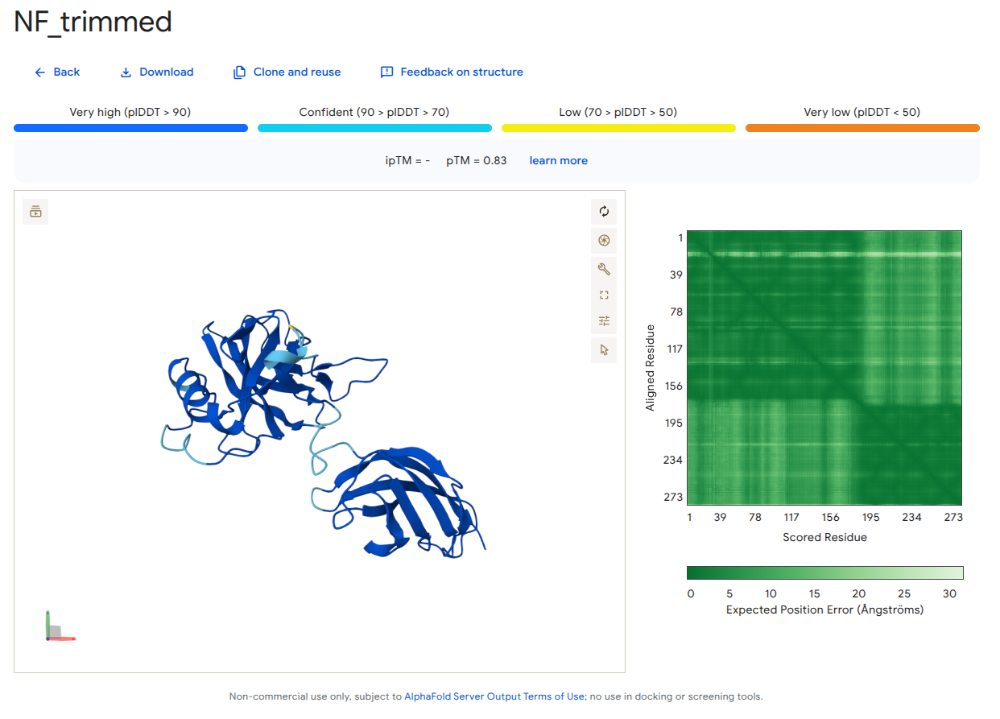
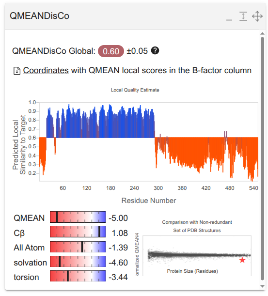
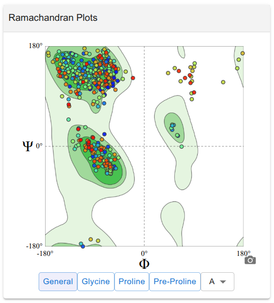
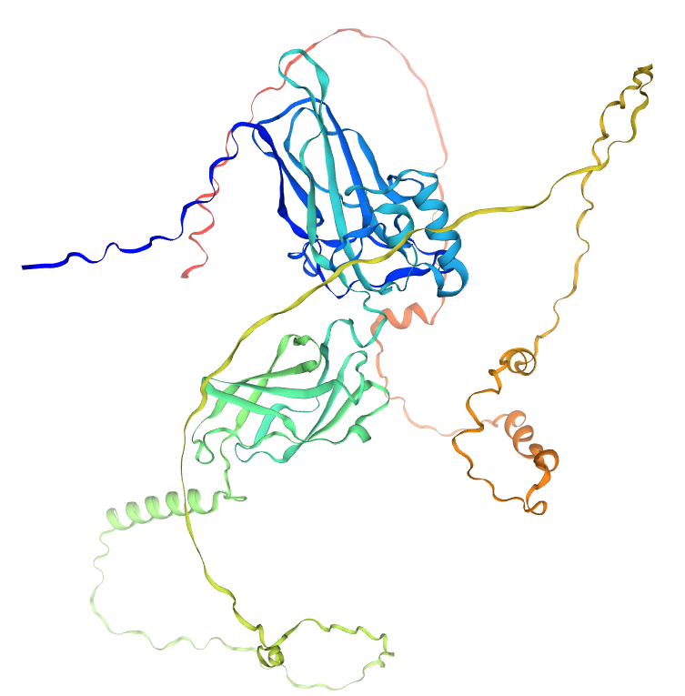
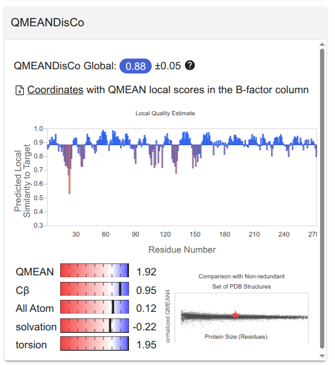
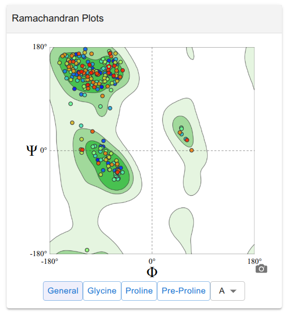
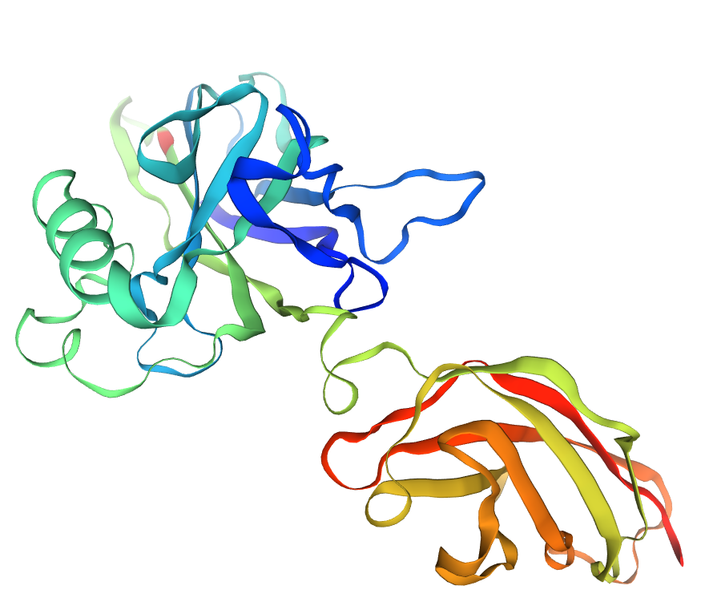

# Predicción Estructural del Factor de Transcripción NF-κB (RELA)
*Dulce Alejandra Carrillo Carlos*

## 1. Introducción

En esta actividad se realizó la predicción estructural del factor de transcripción NF-κB p65 (RELA), un regulador central de la respuesta inmune e inflamatoria, utilizando AlphaFold 3.

La secuencia de la proteína fue obtenida de UniProt (Q04206).

RELA es una subunidad del complejo NF-κB que participa en la regulación de genes asociados con inflamación, respuesta inmune innata, supervivencia celular y activación de linfocitos. Su arquitectura incluye:

- Un dominio estructurado N-terminal denominado Rel Homology Domain (RHD), responsable de la dimerización y unión al ADN.
- Una región C-terminal intrínsecamente desordenada que contiene el dominio de transactivación.

## 2. Secuencia de ADN

El modelado proteína–ADN se realizó utilizando un motivo consenso κB:

5' - GGGAATTTCC - 3'  
3' - CCCTTAAAGG - 5'

Este motivo representa un sitio funcional de unión al ADN ampliamente caracterizado en estudios estructurales de NF-κB.

## 3. Estrategia de Modelado

Se generaron dos modelos estructurales:

- **RELA_full**: utilizando la secuencia completa.
- **RELA_trimmed**: utilizando únicamente el dominio estructurado de unión al ADN (residuos 19–291).

Esta estrategia permite distinguir entre:

- Desorden estructural funcional.
- Arquitectura del dominio de unión al ADN.

# 4. Resultados de AlphaFold

## 4.1 Modelo Completo (NF_full)

El modelo completo mostró:

- Un núcleo estructurado correspondiente al dominio RHD.
- Regiones extendidas con baja confianza estructural en el extremo C-terminal.

**pTM = 0.53**

El mapa PAE indicó:

- Alta confianza en la región N-terminal estructurada.
- Baja precisión en la organización global de las regiones C-terminales.

Este comportamiento es consistente con la naturaleza intrínsecamente desordenada del dominio de transactivación.

## 4.2 Modelo Recortado (NF_trimmed)

El modelo recortado mostró:

- Dominio compacto.
- Mayor coherencia estructural.
- Distribución homogénea del error predicho.

**pTM = 0.83**

La mejora observada sugiere que la eliminación de regiones desordenadas permite evaluar con mayor precisión la arquitectura del dominio funcional.

# 5. Evaluación de Calidad Estructural con Swiss-Model

## 5.1 NF_full

### Calidad Global

**QMEANDisCo Global: 0.60 ± 0.05**

El perfil de calidad local mostró dos comportamientos estructurales distintos:

- Región RHD (~20–300): valores altos de similitud estructural (~0.8–0.9).
- Región C-terminal: caída significativa de calidad (0.2–0.5).

Esto indica que el núcleo estructurado está bien definido, mientras que las regiones posteriores presentan baja confiabilidad estructural.

Los componentes energéticos mostraron penalización en términos relacionados con solvatación y empaquetamiento, coherente con regiones extendidas sin núcleo compacto.

### Ramachandran

El diagrama mostró:

- Mayoría de residuos en regiones permitidas.
- Algunas desviaciones concentradas en regiones flexibles.

Esto indica buena geometría en el núcleo estructurado, con variabilidad en segmentos desordenados.

### Interpretación NF_full

- El dominio RHD presenta geometría adecuada.
- Las regiones C-terminales desordenadas penalizan las métricas globales.
- La baja calidad global refleja desorden biológico real y no error de modelado.

## 5.2 NF_trimmed

### Calidad Global

**QMEANDisCo Global: 0.88 ± 0.05**

El perfil local mostró:

- Valores homogéneos entre 0.85–0.95.
- Ausencia de caídas abruptas.
- Alta similitud estructural respecto a proteínas experimentales.

### Componentes del QMEAN

- QMEAN total: 1.92  
- Cβ: 0.95  
- All atom: 0.12  
- Solvation: −0.22  
- Torsion: 1.95  

Estos valores indican:

- Buena geometría de empaquetamiento.
- Consistencia torsional adecuada.
- Ausencia de penalizaciones severas.

### Ramachandran

El diagrama mostró:

- Mayoría de residuos en regiones altamente favorecidas.
- Distribución clara en regiones α y β.
- Muy pocos outliers.

Esto confirma buena calidad estereoquímica del dominio RHD.

### Arquitectura 3D

La estructura muestra:

- Dominio compacto.
- Láminas β antiparalelas características del RHD.
- Hélices bien definidas.
- Ausencia de extensiones flexibles largas.

La organización es coherente con:

- Región de dimerización.
- Superficie de unión al ADN.

# 6. Comparación Full vs Trimmed

| Modelo | pTM | QMEANDisCo | Calidad Local | Interpretación |
|--------|------|------------|---------------|----------------|
| Full | 0.53 | 0.60 | Heterogénea | Penalizado por desorden C-terminal |
| Trimmed | 0.83 | 0.88 | Homogénea | Dominio estructurado estable |

La eliminación del dominio C-terminal:

- Mejora significativamente las métricas globales.
- Revela la estabilidad del núcleo funcional.
- Confirma la naturaleza modular de RELA.

# 7. Conclusión

Los resultados indican que:

1. El dominio RHD de RELA es estructuralmente estable y confiable.
2. Las regiones C-terminales son intrínsecamente desordenadas.
3. La baja calidad global del modelo completo refleja desorden funcional real.
4. El modelo trimmed es adecuado para:
   - Estudios proteína–ADN.
   - Docking molecular.
   - Modelado de complejos NF-κB.

Este análisis resalta la importancia de considerar la organización modular y la presencia de regiones intrínsecamente desordenadas al interpretar predicciones generadas por AlphaFold.