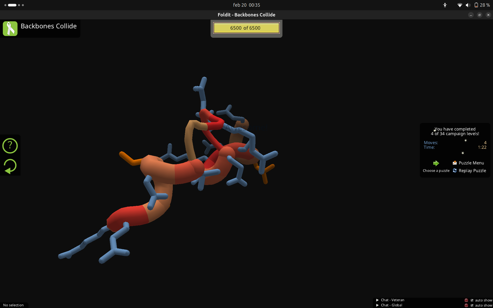

# **Foldit**
**Dulce Alejandra Carrillo Carlos**
Lunes 16 de febrero de 2026

## Introducción

Foldit es un videojuego científico cuyo objetivo es involucrar a cualquier persona en la resolución de problemas reales de biología estructural. A través de una interfaz interactiva, los usuarios pueden manipular estructuras tridimensionales de proteínas para encontrar configuraciones más estables.

## Fundamento biológico

Las proteínas son macromoléculas formadas por cadenas de aminoácidos que deben adoptar una estructura tridimensional específica para poder cumplir su función biológica.

El proceso mediante el cual una proteína adquiere su conformación funcional se conoce como **plegamiento proteico**.

La estructura final depende principalmente de:

* Interacciones hidrofóbicas.
* Puentes de hidrógeno.
* Interacciones electrostáticas.
* Fuerzas de Van der Waals.
* Minimización de la energía libre del sistema.

Foldit simula estos principios mediante algoritmos que calculan la energía estructural. 

## Objetivo del juego

* Manipular la estructura tridimensional de la proteína.
* Reducir su energía total.
* Obtener la mayor puntuación posible.

La puntuación se basa en la estabilidad energética del modelo generado. Una menor energía corresponde a una conformación más estable y, por lo tanto, biológicamente más probable.

## Ejercicios 

## Conclusión

Foldit representa una innovadora herramienta que integra educación, gamificación y ciencia colaborativa. Permite comprender de manera práctica cómo la estructura tridimensional de una proteína depende de la optimización energética y de las interacciones intramoleculares que estabilizan su conformación.
