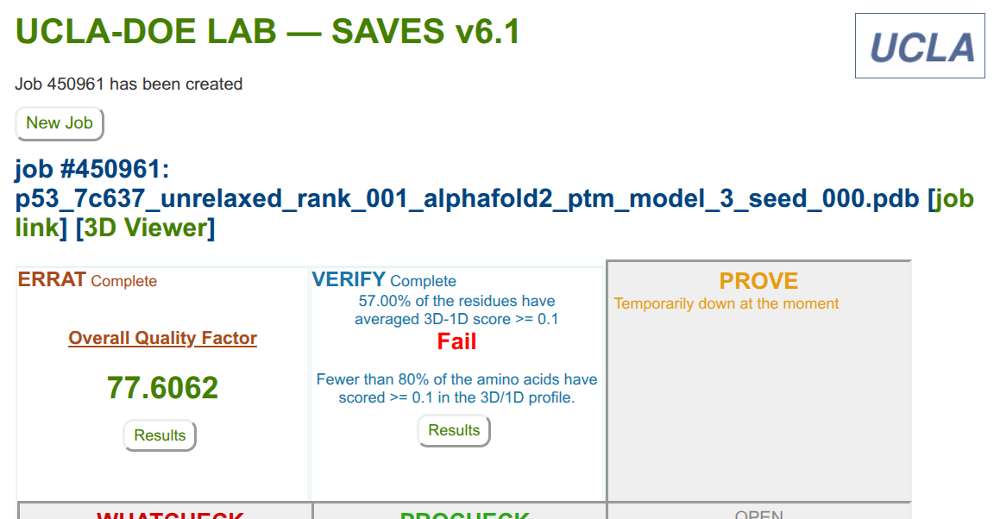

# Interpretación de Resultados AlphaFold 2
*Dulce Alejandra Carrillo Carlos*

## Resultados de SAVES v6.1

La herramienta SAVES (Structural Analysis and Verification Server) proporciona una validación integral de la estructura proteica.

Los resultados obtenidos muestran:

* **ERRAT**: El factor de calidad general es de **77.6062**. ERRAT analiza las estadísticas de interacciones no enlazadas entre diferentes tipos de átomos. Un valor más alto indica una mejor calidad estructural. En este caso, el valor obtenido sugiere que el modelo presenta una calidad global aceptable, aunque todavía pueden existir regiones con cierto grado de incertidumbre estructural o empaquetamiento subóptimo.

* **VERIFY 3D**: El resultado es **FAIL**. Solo el **57%** de los residuos tienen una puntuación promediada 3D-1D >= 0.1. Para aprobar esta prueba, al menos el 80% de los residuos deben superar este umbral. Este resultado sugiere que algunas regiones del modelo no presentan un entorno estructural completamente compatible con su secuencia. Esto es común en proteínas que contienen regiones intrínsecamente desordenadas o altamente flexibles.

## Resultados de Swiss-Model Structure Assessment

Swiss-Model proporciona métricas adicionales para evaluar la calidad geométrica y estructural del modelo.

### QMEAN y QMEANDisCo

**QMEANDisCo Global**: El valor obtenido fue de **0.59 ± 0.05**.

QMEAN (Qualitative Model Energy Analysis) es un estimador compuesto basado en diferentes propiedades geométricas. Este proporciona estimaciones de calidad tanto globales como locales del modelo estructural.

Los valores de QMEANDisCo oscilan entre **0 y 1**, donde:

* Valores cercanos a **1** → Alta similitud con estructuras experimentales  
* Valores cercanos a **0.5** → Calidad moderada  
* Valores bajos → Posibles desviaciones estructurales  

El valor obtenido de 0.59 indica que el modelo presenta una **calidad estructural moderada**, lo cual es consistente con estructuras predichas que contienen regiones flexibles.

El análisis local muestra que:

* La región central de la proteína presenta buena calidad estructural.  
* Las regiones terminales presentan menor confianza estructural.  

Esto sugiere la presencia de zonas desordenadas o dinámicas.

### Gráfico de Ramachandran

El gráfico de Ramachandran visualiza los ángulos diedros φ (phi) y ψ (psi) del esqueleto de la proteína.

En el gráfico observado:

* La mayoría de los residuos se localizan en regiones favorecidas.  
* Algunos residuos aparecen en regiones permitidas.  
* Un pequeño número se encuentra fuera de estas zonas.  

Esto indica que:

✔ El modelo posee una geometría estereoquímica globalmente adecuada  
⚠ Algunas posiciones presentan posibles tensiones estructurales  

Este comportamiento es esperable en regiones flexibles o desordenadas.

### Calidad Local

El perfil de calidad local muestra dos comportamientos distintos:

* **Región central (~100–300 residuos):**
  - Alta similitud estructural  
  - Mayor estabilidad conformacional  

* **Regiones N-terminal y C-terminal:**
  - Menor calidad estructural  
  - Mayor variabilidad  

Esto es consistente con la presencia de regiones dinámicas que no adoptan una conformación única estable.

### Estructura 3D

La visualización tridimensional del modelo muestra:

* Un núcleo estructurado compuesto por hélices α y láminas β  
* Bucles que conectan los elementos secundarios  
* Regiones extendidas con menor grado de orden  

El modelo presenta una arquitectura global coherente, con dominios estructurados conectados por regiones más flexibles.

## Conclusión

El análisis estructural sugiere que el modelo predicho por AlphaFold2 presenta:

- Calidad global aceptable (ERRAT)  
- Núcleo estructural confiable (QMEANDisCo)  
- Geometría mayormente favorable (Ramachandran)  

Las discrepancias observadas se concentran en regiones de menor estabilidad, lo cual es consistente con la presencia de segmentos flexibles.

En conjunto, el modelo puede considerarse estructuralmente confiable para análisis estructurales y funcionales a nivel global.